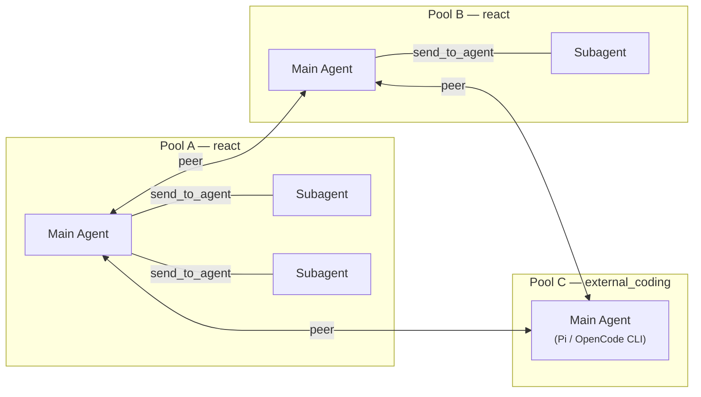

# Multi-Agent

ModexAgent runs multi-agent systems in **Pool mode**: agents live in persistent pools, stay resident between messages, and talk to each other over routed channels instead of ad-hoc function calls. Two components do the routing: the `MessageBroker` moves messages, and the `AgentMessageBus` is the primary async channel each agent listens on.

The `AgentPool` manages the resident agents' lifecycle: a consumer loop per agent, inbox wakeup polling, per-session locks, and TTL + LRU eviction of idle sessions. Because agents are persistent, a conversation picks up where it left off rather than cold-starting every turn.

## Star topology inside a pool

Each pool is a strict star. One **main agent** is the hub; **subagents** are spokes.

Agents communicate through a single tool: `send_to_agent`. The framework decides internally how to deliver, whether that means broker delivery, the async inbox, or waking an isolated subagent session. The sender never chooses a transport.

!!! warning "The topology gate"
    Subagents may only talk to their parent. Subagent↔subagent and subagent→non-parent sends are rejected by the topology gate, enforced at registration. All coordination flows through the main agent, which keeps the communication graph readable and auditable.

Two safeguards keep the star healthy:

- **Isolation.** Each subagent gets its own Memory, ToolManager, and SkillManager, with a restricted, session-only memory window.
- **Safety net.** If the LLM forgets to call a communication tool, the `SubagentAutoSendHook` auto-forwards the subagent's final output to its parent.

## Peer messaging across pools

Stars don't connect to each other through their spokes. Instead, **main agents communicate as peers**: a main agent can `send_to_agent` another pool's main agent, which receives the message on its own bus and replies in kind. Pools stay autonomous, yet a system of pools can still divide labor.

Inside each react pool the topology is a strict star: one main agent as hub,
subagents as spokes, all routed through the single `send_to_agent` tool. Across
pools, main agents talk as peers — including the main agent of an
external_coding pool, which has no subagents and no graph runtime of its own.

## External coding agents as peers

External coding agents such as **Pi** and **OpenCode** join the same peer topology as NORMAL main agents of their own dedicated pools (`pool_pi`, `pool_opencode`). They don't have the `send_to_agent` tool, so they reply through a CLI shim the framework ships for this purpose: `modexctl send` (part of the `modexbot`/`modexctl` facade). The shim delivers an XML-wrapped `<agent_message>` straight into the target workspace's inbox. Every other agent reaches them with the standard `send_to_agent` tool, so from the framework's point of view they are ordinary pool mains.

## I/O stays outside the agent

I/O adapters are fully decoupled from agent logic. The WebUI, CLI, and IM platforms (QQ, Telegram) all plug into the same broker, so swapping or adding a channel never touches the agents themselves.

## Where to next

- ReAct subagents in a pool run the [Graph Engine](graph-engine.md) runtime, so they can suspend for approval too. External coding agent main agents (Pi / OpenCode) run their own CLI harness and do not use the graph.
- What each agent remembers is governed by the [Memory](memory.md) tiers.
- Set up your first bot in [Installation](../installation.md) or [Get Started](../get-started.md).
