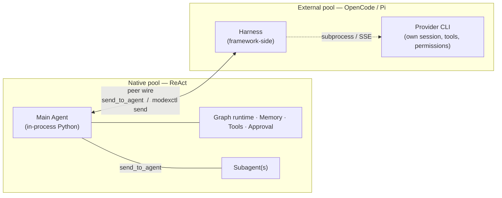

# External Coding Agents

ModexAgent's ReAct agents are in-process Python. But the industry is full of coding-agent CLIs — **Pi**, **OpenCode**, and tomorrow Claude Code / Codex / Cursor — that already know how to read `AGENTS.md`, discover skills, run bash tools, and resume their own sessions. Re-implementing that machinery inside a ReAct agent is wasteful.

External coding agent integration (ADR-0022) lets you register those CLIs as **NORMAL main agents of their own dedicated pools**. Your existing ReAct agents reach them through the same `send_to_agent` they already use to talk to any peer. The external CLI replies through a shipped shim. Everything shows up in the WebUI alongside your other agents.

## Native vs external, side by side

Both kinds of pool sit on the same peer wire. What's inside differs:



A native pool is one box: the framework owns the agent, its memory, its tools, and its approval flow. An external pool is two: a thin framework-side **harness** wraps the provider CLI, which owns its own session, tools, and permission model. The peer wire on top is symmetric from the framework's view — but the tools the two sides use to send messages are not.

| | Native ReAct agent | External coding agent |
|---|---|---|
| Runs as | In-process Python | External CLI (subprocess or warm SSE) |
| Pool role | Main agent or subagent | Main agent or subagent (ADR-0027) |
| Reaches peers with | `send_to_agent` tool | `modexctl send` CLI shim |
| Memory | Framework 3-layer memory | Provider's own session file |
| Tool execution | Framework `ToolManager` | Provider's own tools (bash, edit, …) |
| Risky-action approval | Framework `GraphInterrupt` + approval UI | Provider's own permission model |
| WebUI transcript | Direct emit | Projected from provider events |
| Resumes via | Framework session store | Provider session id (Pi: JSONL path / OpenCode: minted id) |

The asymmetry is deliberate. The framework does not re-implement what the provider already does well (file editing, shell, session resume); it just routes messages in and out and renders the provider's event stream in your WebUI.

## External coding agents as subagents (ADR-0027)

External coding agents are not limited to pool main agents. Per
[ADR-0027](https://github.com/moyu-er/ModexAgent/blob/main/docs/adr/0027-external-coding-agent-as-subagent.md),
an external coding CLI can also be configured as a **subagent** inside a react
pool. The `SubagentSpec` gains `execution_strategy` and `provider_kind` fields,
so a subagent template can opt into the external coding harness just like a
pool main agent can.

The reference bot's `coder` pool ships a real example: the `orchestrator` main
agent delegates implementation tasks to a `worker` subagent that runs the
OpenCode CLI:

```yaml
# config/pools/coder/templates/worker.yml
agent_name: worker
execution_strategy: external_coding   # opt-in; default is "react"
provider_kind: opencode               # "pi" or "opencode"
```

The orchestrator reaches `worker` through the same `send_to_agent` it uses for
any subagent. The worker runs the external CLI, does its work with its own
tools and session, and returns the result through the standard subagent
communication path.

!!! note "Star topology still applies"
    As a subagent, the external coding agent follows the same star-topology
    rule as any subagent: it can only talk to its parent. It does not
    participate in cross-pool peer messaging and does not have the
    `send_to_agent` tool. Peer messaging remains a main-agent-only capability —
    external agents that need to be full peers are configured as main agents of
    their own dedicated pools (see the `opencode` pool in
    [Multi-Agent](multi-agent.md)).

## How to use it

### 1. Register an external pool

Add a pool under `config/pools/<name>/pool.yml` with `execution_strategy: external_coding`:

```yaml
main_agent_name: opencode
execution_strategy: external_coding   # opt-in; default is "react"
provider_kind: opencode               # "pi" or "opencode"
peers:
  - default                           # explicit peer declaration required
```

Or create it from the WebUI **Settings → Pools** tab, which ships a `PoolEditor` section for external coding providers — no YAML hand-editing required.

!!! note "Availability gating"
    If the provider CLI (`pi` or `opencode`) is not on `PATH`, the pool is silently skipped at startup with a warning. Other pools are unaffected — install the CLI and restart to enable the pool.

### 2. Talk to it from another agent

Nothing changes on the sending side. A peer main agent calls the same `send_to_agent` it uses for any peer:

```text
send_to_agent(target_agent="opencode", message="refactor utils.py for me")
```

The message lands in the external pool's inbox, the harness wakes the provider, the provider does its work, and the response comes back through the same peer channel.

### 3. Watch it in the WebUI

External agent sessions appear in the WebUI session list with a `.pi` / `.opencode` suffix, alongside every other session. Streaming output — text, reasoning, tool calls and results, errors — renders the same way it does for any agent. You do not need to leave the UI to inspect what the external CLI is doing.

### 4. The external agent talks back

The provider's LLM does **not** have a `send_to_agent` tool. Instead, the harness injects a small set of instructions into its system prompt telling it about a CLI shim:

```bash
modexctl send --to <peer_name> --content "<your reply>"
modexctl agents     # list routable peers
```

The operator does not write this. The provider discovers the shim, the peer names, and the rule that *stdout is observed but not delivered* through the injected prompt, and calls `modexctl send` from its own bash tool when it needs to reply.

## Supported providers

| Provider | Status | Transport |
|---|---|---|
| **OpenCode** | shipped | Warm `opencode serve` SSE by default; sticky `opencode run` subprocess fallback if SSE startup fails |
| **Pi** | shipped | Per-turn subprocess (JSONL transcript resume) |
| **Claude Code** | deferred | Its bidirectional `control_request` channel and `run_in_background` rewrite are the most complex of any provider; waiting on Pi + OpenCode to prove the model in production |

Adding a new provider is one file (`providers/<name>.py`) plus one value in the `ProviderKind` enum. The provider backend ABC, the event parser interface, the env builder, the OS layer, and the CLI shim are all provider-agnostic — they were shaped so the work stays local.

## What it doesn't do

- **No framework memory layer on external agents.** The provider's own session file is the source of truth. The transcript you see in the WebUI is a UI projection — the external CLI never reads it back. This applies to both external pool mains and external subagents.
- **No framework approval on external pools.** Risky-action gating uses the provider's own permission model (e.g. OpenCode's `--dangerously-skip-permissions` flag), not the framework's `GraphInterrupt`. The framework's approval UI does not fire for external pool work.
- **No cross-workspace routing.** `modexctl send` routes within one workspace's inbox. Multi-workspace topologies are out of scope.
- **Status / log / token-usage events are dropped.** The parser interface admits them for later; day one ships text, reasoning, tool calls, tool results, and errors.

## Where to next

- External agents sit on the cross-pool peer topology defined in [Multi-Agent](multi-agent.md).
- They do **not** run the [Graph Engine](graph-engine.md) — that's why framework approval doesn't apply to them.
- Why external pools have no framework memory: see [Memory](memory.md).
- For the full design and rationale, see ADR-0022 (main-agent integration) and ADR-0027 (subagent extension) in the framework repo.
