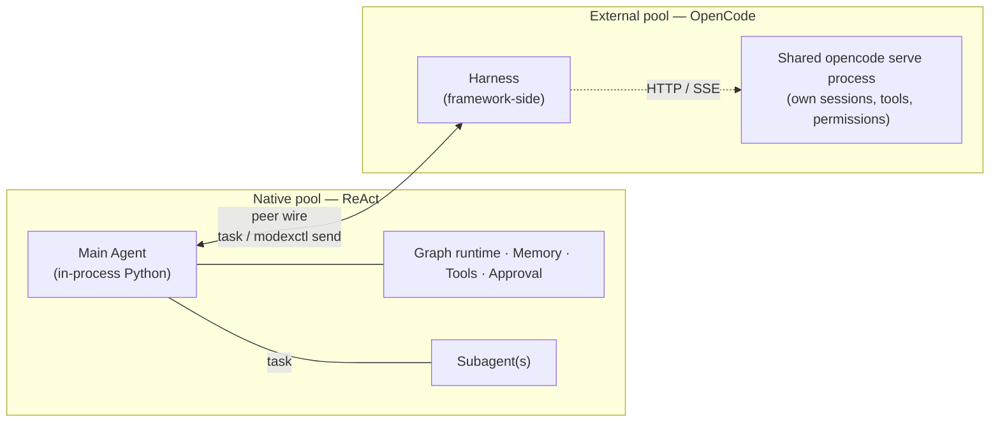

# External Coding Agents

ModexAgent's ReAct agents are in-process Python. But the industry is full of coding-agent CLIs — **OpenCode** today, Claude Code / Codex / Cursor tomorrow — that already know how to read `AGENTS.md`, discover skills, run bash tools, and resume their own sessions. Re-implementing that machinery inside a ReAct agent is wasteful.

External coding agent integration (ADR-0022) lets you register those CLIs as **NORMAL main agents of their own dedicated pools**. Your existing ReAct agents reach them through the same `task` tool they already use to talk to any peer. The external agent replies through `modexctl`, a small CLI shipped with the bot. Everything shows up in the WebUI alongside your other agents.

## Native vs external, side by side

Both kinds of pool sit on the same peer wire. What's inside differs:


```mermaid
flowchart LR
    subgraph Native["Native pool — ReAct"]
        direction TB
        NMA["Main Agent<br/>(in-process Python)"]
        NRT["Graph runtime · Memory · Tools · Approval"]
        NMA --- NRT
        NSA["Subagent(s)"]
        NMA ---|task| NSA
    end
    subgraph External["External pool — OpenCode"]
        direction TB
        EMA["Harness<br/>(framework-side)"]
        ECLI["Shared opencode serve process<br/>(own sessions, tools, permissions)"]
        EMA -.->|"HTTP / SSE"| ECLI
    end
    NMA <-->|"peer wire<br/>task  /  modexctl send"| EMA
```

A native pool is one box: the framework owns the agent, its memory, its tools, and its approval flow. An external pool is two: a thin framework-side **harness** wraps the provider CLI, which owns its own sessions, tools, and permission model. The peer wire on top is symmetric from the framework's view — but the tools the two sides use to send messages are not.

| | Native ReAct agent | External coding agent |
|---|---|---|
| Runs as | In-process Python | External CLI in a shared `opencode serve` process |
| Pool role | Main agent or subagent | Main agent or subagent (ADR-0027) |
| Reaches peers with | `task` tool | `modexctl send` CLI shim |
| Memory | Framework memory (session + opt-in long-term) | Provider's own session |
| Tool execution | Framework `ToolManager` | Provider's own tools (bash, edit, …) |
| Risky-action approval | Framework `GraphInterrupt` + approval UI | Provider's own permission model |
| WebUI transcript | Direct emit | Projected from provider events |
| Resumes via | Framework session store | Provider-minted session id |

The asymmetry is deliberate. The framework does not re-implement what the provider already does well (file editing, shell, session resume); it just routes messages in and out and renders the provider's event stream in your WebUI.

## One shared OpenCode process

The harness does not spawn a CLI process per pool or per turn. A process-wide manager owns a **single `opencode serve` process** shared by every OpenCode pool and every session:

- **Lazy start and self-healing.** The server starts on first use. A health watchdog respawns it if it dies, and stale processes left behind by a previous run are reaped at startup.
- **Event-driven turns.** A persistent SSE reader per working directory streams provider events — text, reasoning, tool calls, errors — into the canonical event model the WebUI renders. Turn completion is decided by a state machine that waits for the whole provider session tree to go quiet, not by polling.
- **Child sessions are first-class.** When OpenCode forks its own internal subagent sessions, the harness discovers them from the event stream and registers them as real ModexAgent sessions. They appear nested under their parent in the WebUI session tree, with their own transcripts.
- **Per-session identity without per-session processes.** The shared process's environment is frozen at first spawn, so the harness injects identity another way: a small OpenCode plugin stamps every bash call with its session id, and `modexctl` resolves the matching per-session environment snapshot. Concurrent sessions cannot cross-talk.

## External coding agents as subagents (ADR-0027)

External coding agents are not limited to pool main agents. Per
[ADR-0027](https://github.com/moyu-er/ModexAgent/blob/main/docs/adr/0027-external-coding-agent-as-subagent.md),
an external coding CLI can also be configured as a **subagent** inside a react
pool. The `SubagentSpec` gains `execution_strategy` and `provider_kind` fields,
so a subagent template can opt into the external coding harness just like a
pool main agent can.

The reference bot's `coder` pool ships a real example: the `orchestrator` main
agent delegates implementation tasks to a `coder` subagent that runs the
OpenCode CLI, alongside a native read-only `explore` subagent for codebase
investigation:

```yaml
# config/pools/coder/templates/coder.yml
agent_name: coder
execution_strategy: external   # opt-in; default is "react"
provider_kind: opencode
```

The orchestrator reaches `coder` through the same `task` tool it uses for
any subagent. The subagent runs the external CLI, does its work with its own
tools and session, and its final reply is forwarded back to the caller
automatically when the turn ends.

!!! note "Star topology still applies"
    As a subagent, the external coding agent follows the same star-topology
    rule as any subagent: the only target it can address is its parent. It
    does not participate in cross-pool peer messaging and has no communication
    tools at all — its final reply is delivered for it, and
    `modexctl send` is reserved for asking the parent a question or
    requesting a decision mid-turn. Peer messaging remains a main-agent-only
    capability — external agents that need to be full peers are configured as
    main agents of their own dedicated pools (see the `opencode` pool in
    [Multi-Agent](multi-agent.md)).

## How to use it

### 1. Register an external pool

Add a pool under `config/pools/<name>/pool.yml` with `execution_strategy: external`:

```yaml
main_agent_name: opencode
execution_strategy: external   # opt-in; default is "react"
provider_kind: opencode
peers:
  - default                    # explicit peer declaration required
```

Or create it from the WebUI **Settings → Pools** tab, which ships a `PoolEditor` section for external coding providers — no YAML hand-editing required.

!!! note "Availability gating"
    If the provider CLI (`opencode`) is not on `PATH`, the pool is silently skipped at startup with a warning. Other pools are unaffected — install the CLI and restart to enable the pool.

### 2. Talk to it from another agent

Nothing changes on the sending side. A peer main agent calls the same `task` tool it uses for any peer:

```text
task(target_agent="opencode", content="refactor utils.py for me")
```

The message lands in the external pool's inbox, the harness wakes the provider, the provider does its work, and the response comes back through the same peer channel.

### 3. Watch it in the WebUI

External agent sessions appear in the WebUI session list alongside every other session — the shipped pool's agent is named `opencode`, so its sessions carry that suffix. Streaming output — text, reasoning, tool calls and results, errors — renders the same way it does for any agent, and subagent sessions the provider forks internally show up nested in the session tree. You do not need to leave the UI to inspect what the external CLI is doing.

### 4. The external agent talks back

The provider's LLM has no communication tools. Instead, the harness injects a small set of instructions into its system prompt telling it about a CLI shim:

```bash
modexctl send --to <peer_name> --content "<your reply>"
modexctl agents     # list routable peers
```

`modexctl` ships with the bot, not the framework package: it is a thin client over the bot's HTTP control plane (ADR-0035). The harness injects the `MODEX_*` environment variables that tell it which session, workspace, and agent it is acting for — the operator writes none of this. The provider discovers the shim, the peer names, and the rule that *stdout is observed but not delivered* through the injected prompt, and calls `modexctl send` from its own bash tool when it needs to reply.

## Supported providers

| Provider | Status | Transport |
|---|---|---|
| **OpenCode** | shipped | One shared `opencode serve` process per bot; persistent SSE event stream per working directory |
| **Claude Code** | deferred | Its bidirectional `control_request` channel and `run_in_background` rewrite are the most complex of any provider; waiting on OpenCode to prove the model in production |

Earlier revisions of this integration also shipped a **Pi** provider; it has since been removed, and OpenCode is the only supported provider today. The provider seam — the backend interface, the event parser, the env builder, the OS layer, and the CLI shim — remains provider-agnostic, so adding a new provider is still a local change: a new provider package plus one value in the `ProviderKind` enum.

## What it doesn't do

- **No framework memory layer on external agents.** The provider's own session is the source of truth. The transcript you see in the WebUI is a UI projection — the external CLI never reads it back. This applies to both external pool mains and external subagents.
- **No framework approval on external pools.** Risky-action gating uses the provider's own permission model — the harness configures OpenCode to auto-allow permissions so no runtime prompts fire — not the framework's `GraphInterrupt`. The framework's approval UI does not fire for external pool work.
- **No cross-workspace routing.** `modexctl send` routes within one workspace's inbox. Multi-workspace topologies are out of scope.
- **Status / log / token-usage events are not rendered.** The transcript projection ships text, reasoning, tool calls, tool results, and errors; session-status events drive turn completion behind the scenes but stay off the transcript.

## Where to next

- External agents sit on the cross-pool peer topology defined in [Multi-Agent](multi-agent.md).
- They do **not** run the [Graph Engine](graph-engine.md) — that's why framework approval doesn't apply to them.
- Why external pools have no framework memory: see [Memory](memory.md).
- For the full design and rationale, see ADR-0022 (main-agent integration), ADR-0027 (subagent extension), and ADR-0035 (the `modexctl` control plane) in the framework repo.
