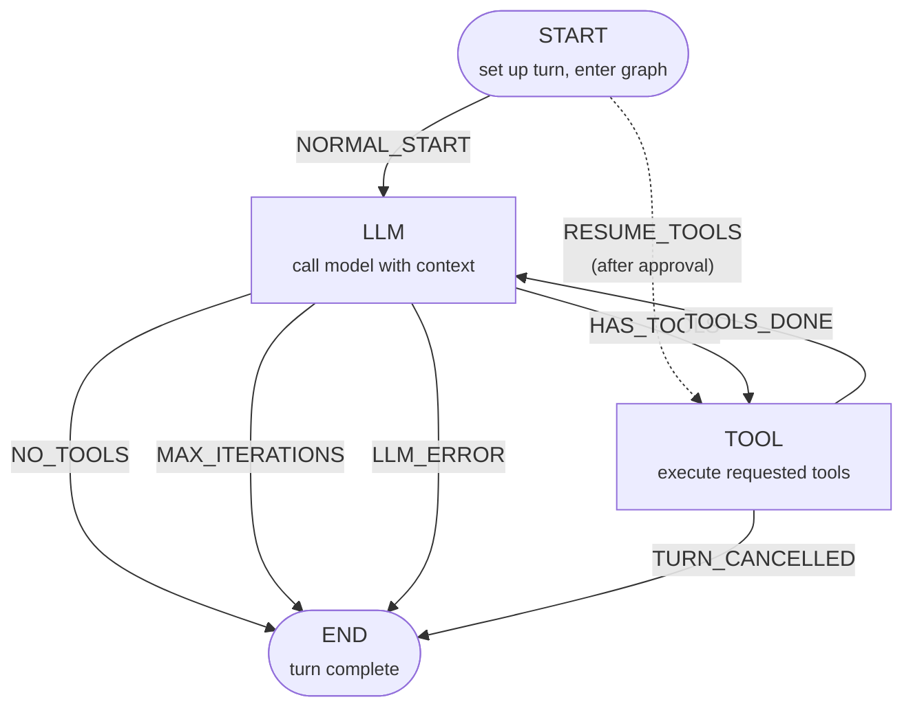
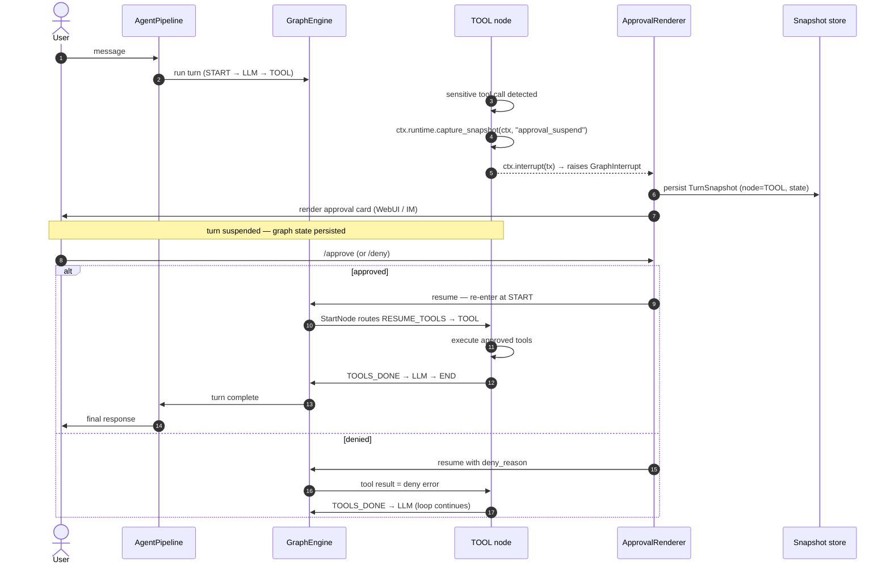

# Graph Engine

Most agent frameworks are built around a loop: call the model, run the tools it
asks for, feed the results back, repeat until done. ModexAgent's built-in
**ReAct agent** replaces that loop with a **graph-driven execution engine**.

That engine lives in `modex_graph` — a **standalone Python package** (per
[ADR-0033](https://github.com/moyu-er/ModexAgent/blob/main/docs/adr/0033-generalized-graph-engine.md))
that depends only on Pydantic and the standard library. It is a sibling of
`modex_agent`, not a submodule: `modex_agent` depends on `modex_graph`, the
reverse is **forbidden** and enforced by an architecture guard test. Any
project can adopt the graph engine without pulling in the agent framework.

The core abstraction: you declare a `Graph[S]` where `S` is a `GraphState`
(Pydantic `BaseModel` subclass). You register `Node[S]` instances, wire edges
between them, then `compile()` produces an immutable `CompiledGraph[S]`. A
`GraphEngine` drives execution — it calls each node's `execute(ctx)`, applies
any declarative state update, then resolves the next node via a strict-priority
routing cascade. The loop terminates at the `GraphNode.END` sentinel.

That one design buys four things: **suspension**, **resumption**, **typed
state with reducer semantics**, and **controlled exits**.

!!! note "Which pools run the graph?"
    The graph engine is the runtime of **react pools** — the default. Other pool
    shapes exist: **external coding agent pools** (Pi / OpenCode, per ADR-0022)
    run their own CLI harness and do not use the graph at all. When this page
    says "the agent" or "the runtime", it means a ReAct agent on a graph.

## The ReAct runtime as four nodes

The built-in ReAct agent is a small graph with four nodes and eight edges,
assembled by `build_react_graph()` in `modex_agent/agents/react/graph.py`.
Every edge carries a `reason` — an enum value that fired the transition — so
the framework always knows *why* it moved between nodes, not just *that* it did.



| Node | Role |
|------|------|
| START | Sets up the turn and enters the graph. On resume from a suspended approval, routes directly to TOOL. |
| LLM | Calls the model with the current context, handles streaming, dispatches hooks and interceptors. |
| TOOL | Executes the tool calls the model requested. Suspends for approval before risky calls. |
| END | Assembles the `AgentResult` (normal / error / cancelled). Reached when the model responds without tool calls, the iteration budget is exhausted, the model errors, or the turn is cancelled. |

The dashed `START → TOOL` edge is the one that makes approval work: when a
suspended turn resumes, the engine re-enters the graph at the TOOL node
directly, not at START — so the model isn't called again just to repeat the
tool call it already asked for. This is **suspend-without-re-execution**: the
interrupted node body is never re-run; graph topology carries the resume logic.

Because the loop is a graph, the framework always knows *which node* a turn is
in and *what state* it carries. That is what makes the next features possible.

## GraphInterrupt: suspend, approve, resume

Any node can suspend execution mid-turn by calling `ctx.interrupt(value)`,
which raises a `GraphInterrupt` — a member of the `GraphBubbleUp`
cooperative-control exception family. The engine **never swallows** these;
they propagate to the caller verbatim.

The interrupt carries a payload (e.g. an `ApprovalTransaction` awaiting a human
decision). Crucially, already-applied state updates and side effects **persist**
across the interrupt boundary. On resume the graph re-enters at the entry node
(NOT by re-running the interrupted node body), and the `StartNode` detects the
suspended state and routes to `TOOL`. This is what makes ModexAgent's
interruptible approval work — a risky tool call suspends, a human approves, and
execution continues exactly where it stopped.



!!! warning "Never swallow GraphInterrupt"
    `GraphInterrupt` is control flow, not an error. It must never be caught and
    swallowed, or a paused approval would silently vanish.

## State and channels

Every graph operates on a `GraphState` — a Pydantic `BaseModel` subclass whose
fields are backed by **channels**. A channel defines *how* updates to its field
combine, decoupling update semantics from the field's type.

```python
import operator
from typing import Annotated
from modex_graph import GraphState, LastValue, ReducerChannel

class MyState(GraphState):
    count: Annotated[int, LastValue] = 0                          # last-write-wins (default)
    items: Annotated[list[str], ReducerChannel(reducer=operator.add)] = []  # fan-in via +
```

| Channel | Semantics |
|---------|-----------|
| `LastValue[T]` | Last-write-wins. The default for fields without an annotation. |
| `ReducerChannel[T]` | Folds multiple writes via a binary `reducer` callable (e.g. `operator.add` for list concat, `set.union` for merging). |

State can be mutated two ways, and both coexist:

- **Imperative** — `ctx.state.iteration += 1` mutates the Pydantic field directly.
  The engine syncs fields to channels before a checkpoint.
- **Declarative** — `return NodeResult(state_update={"x": v})`. The engine calls
  `channel.update([v])`, then syncs channels back to fields.

Channels also own **checkpoint serialization**. `state.checkpoint()` returns
per-channel JSON; `GraphState.from_checkpoint(data)` restores each channel
independently. Pydantic `BaseModel` subclasses serialize universally via
`model_dump()` / `model_validate()` — no registration needed. Custom Python
types register a `Codec` through `register_codec()`.

## Routing: four mechanisms, strict priority

A node returns a `NodeResult` describing what to do next. The engine resolves
the next node via a strict-priority cascade:

| Priority | Mechanism | Source | Example |
|----------|-----------|--------|---------|
| 1 | `Command(goto=...)` | `NodeResult.command` | Dynamic jump, fan-out, or multi-target |
| 2 | Pending queue | Engine internal | Remaining targets from a previous `list[str]` goto |
| 3 | `transition: str` | `NodeResult.transition` | Static edge lookup by reason |
| 4 | Conditional edge | `route_fn(state)` | Key-mapped or direct node name |
| 5 | Default edge | `reason=None` edge | Fallback when nothing else matches |

```python
from modex_graph import NodeResult, Command, Task

# Static edge lookup (most common in ReAct)
return NodeResult(transition="HAS_TOOLS")

# Dynamic routing — jump to one node
return NodeResult(command=Command(goto="tool"))

# Fan-out — sequential multi-target (parallel execution is a Phase-c goal)
return NodeResult(command=Command(goto=["worker_a", "worker_b"]))

# Fan-out with independent state
return NodeResult(command=Command(goto=[Task(node="worker", state=isolated_state)]))
```

This lets a node either declare its intent declaratively (a static edge) or
jump dynamically at runtime — and supports both compile-time-known and
runtime-decided topologies in one graph.

## GraphRuntime: AOP without core intrusion

`GraphRuntime` is an ABC with **default no-op implementations** — the engine
runs with zero AOP wiring. Business modules (like `ReactGraphRuntime`) subclass
it to bridge hooks, interceptors, governance, and approval into the graph.

The engine auto-invokes two methods at every node boundary (universal lifecycle
points); six more are called explicitly by node code when business-specific AOP
is needed:

| Method | Invoked by | Purpose |
|--------|-----------|---------|
| `before_node` | Engine (auto) | Universal pre-node lifecycle |
| `after_node` | Engine (auto) | Universal post-node lifecycle |
| `dispatch_hook` | Node (explicit) | Fire a named hook point (e.g. `BEFORE_ITERATION`) |
| `around` | Node (explicit) | Wrap a call boundary (interceptor onion) |
| `apply_governance` | Node (explicit) | Transform messages before an LLM call |
| `drain_control` | Node (explicit) | Check for cancellation at safe points |
| `capture_snapshot` | Node (explicit) | Persist turn state (e.g. before approval suspend) |
| `emit` | Node (explicit) | Fire an event to the runtime |

!!! note "Iteration hooks are not engine-auto-invoked"
    "Iteration" is a ReAct concept (one LLM + TOOL cycle), not a universal graph
    concept. ReAct nodes dispatch `BEFORE_ITERATION` / `AFTER_ITERATION`
    explicitly via `ctx.runtime.dispatch_hook(...)` at the exact code points that
    define an iteration. The graph engine itself has no notion of iterations.

The engine stays free of `modex_agent` types: `hook_point`, `scope`, and
`event_type` parameters are `str` (business modules pass `StrEnum` values, which
are `str` subclasses). This is what keeps `modex_graph` framework-agnostic.

## Graph-is-a-Node

`CompiledGraph` subclasses `Node` — a compiled graph can be embedded as a node
inside an outer graph. This enables **subgraph nesting** and reusable graph
fragments without special-casing:

```python
# A CompiledGraph is a Node[S] — embed it in an outer graph.
outer: Graph[OuterState] = Graph()
outer.add_node("sub_agent", compiled_inner_graph)
outer.add_edge(GraphNode.START, "sub_agent")
compiled = outer.compile()
```

When the outer engine reaches the subgraph node, `CompiledGraph.execute(ctx)`
runs its own `GraphEngine` loop, sharing the parent context's runtime and
user_data while isolating its own state writes.

## Sync and async in one node library

`Node.execute` is declared as `def` (not `async def`). Subclasses may override
with either `def` or `async def` — the engine unifies both via
`inspect.isawaitable(result)` and awaits if needed. One codebase serves sync
scripts (CLI / REPL via `engine.run()`) and async runtimes (ReAct via
`engine.run_async()`), without splitting the node library into `SyncNode` /
`AsyncNode`.

## Loop detection: a controlled exit

A ReAct loop can get stuck: the model keeps requesting the same tool calls
without making progress. A naive framework burns tokens until the context
window or your budget gives out.

ModexAgent's loop detection ([ADR-0016](https://github.com/moyu-er/ModexAgent/blob/main/docs/adr/0016-loop-detection-controlled-exit.md))
treats this as a **controlled exit**, not a graph transition. A
`LoopDetectionHook` runs after each LLM response, scans the recent assistant
turns for "near-identical content **and** identical tool calls" repeated `N`
times in a row (default `N=5`), and raises a `LoopDetectedError`. Because the
error inherits `AgentControlError`, it propagates *around* the graph — straight
to the agent's exit handler — instead of becoming another edge. You get a clean
termination and a chance to inspect what happened, instead of a surprise bill.

Two safety layers coexist: the **business-level** max (a node checks iteration
count and returns `transition=MAX_ITERATIONS` to route to END via a static edge
— a *normal* result) and the **engine-level** `max_iterations` safety net
(exceeding it raises `GraphRecursionError` — an *abnormal* exit that prevents
infinite loops). The engine-level N should be larger than the business max.

`AgentControlError` is part of the framework's control plane — the same
exception family that `/stop` and the WebUI pause button raise. See
[Runtime Layers](runtime-layers.md) for how Hook, Interceptor, and Control
compose.

## Public API at a glance

The `modex_graph` package exports 22 names. The ones you will touch most:

| Type | Role |
|------|------|
| `Graph[S]` | Mutable builder — add nodes, wire edges, `compile()`. |
| `Node[S]` | ABC with one method: `execute(ctx) -> NodeResult`. Sync or async. |
| `CompiledGraph[S]` | Immutable, frozen graph. Subclasses `Node` (Graph-is-a-Node). |
| `GraphEngine[S]` | Drives execution: `run_async(ctx)` / `run(ctx)`. |
| `GraphContext[S]` | Per-run state + runtime + `user_data`. `fork()`, `emit()`, `interrupt()`. |
| `GraphState` | Pydantic `BaseModel` with per-field channels, `checkpoint()` / `from_checkpoint()`. |
| `NodeResult` | Frozen return value: `transition` + `state_update` + `command`. |
| `Command` | Dynamic routing: `goto` (str / list[str] / list[Task]). |
| `Task` | A fan-out target: `node` + optional isolated `state`. |
| `BaseChannel[T]` | ABC for per-field state semantics. |
| `LastValue[T]` | Last-write-wins channel (default). |
| `ReducerChannel[T]` | Fan-in channel via a binary reducer. |
| `GraphRuntime` | AOP bridge ABC — 2 auto-invoked + 6 explicit methods, all default no-op. |
| `GraphInterrupt` | Suspend execution (carries `value` + `node_name`). Never swallowed. |
| `GraphBubbleUp` | Base class for the cooperative-control exception family. |
| `GraphNode` | `StrEnum` with `START` / `END` sentinels. |

!!! note "Phase-c reserved items"
    `GraphDrained` (cooperative shutdown at superstep boundaries) and
    `ParentCommand` (subgraph-to-parent routing) exist as classes but are
    **never raised** in the current phase — they are reserved for future
    Phase-c work. Likewise, `Task` fan-out is sequential today; parallel
    execution is a Phase-c goal, and `LastValue` does not yet enforce
    single-writer semantics.

## Where to next

- ReAct subagents in [Multi-Agent](multi-agent.md) pools run the same graph
  runtime, so they can suspend for approval too. External coding agent pools
  (Pi / OpenCode) do not.
- What the LLM node sees each pass is shaped by the [Memory](memory.md) tiers.
- The `LoopDetectionHook` and cancellation path tie into the three-layer
  [Runtime Layers](runtime-layers.md) model.
- Ready to run an agent? Head to [Get Started](../../get-started.md).
