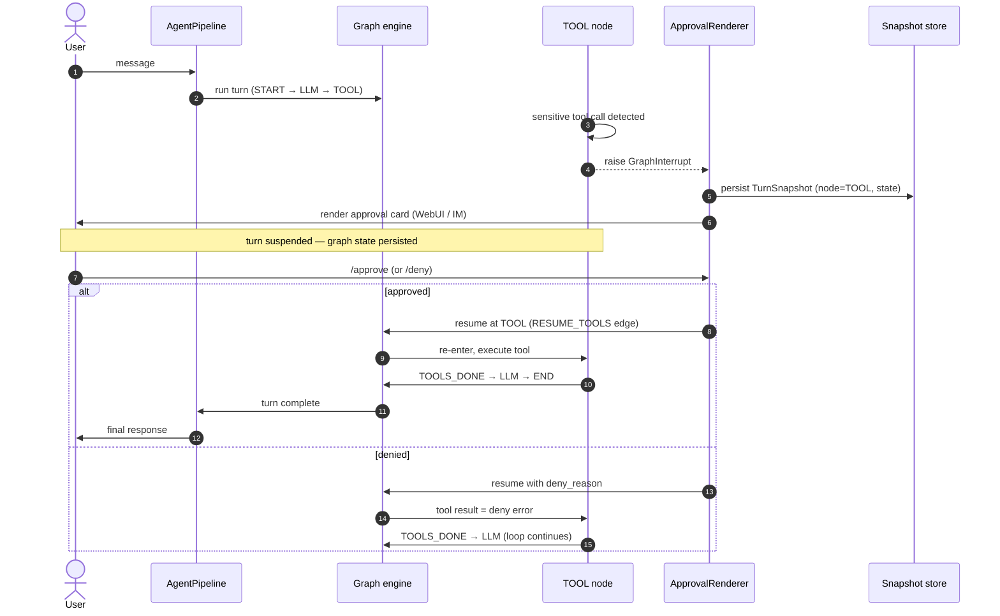

# Graph Engine

Most agent frameworks are built around a loop: call the model, run the tools it asks for, feed the results back, repeat until done. The built-in **ReAct agent** replaces that loop with a **graph-driven execution engine**. Execution is modeled as `Graph[R] + Node[R] + Edge`, where `R` is the result type flowing through the graph. Each node is a unit of work, each edge a transition, and the engine walks the graph instead of spinning a `while` loop.

That one change buys three things: suspension, resumption, and controlled exits.

!!! note "Which pools run the graph?"
    The graph engine is the runtime of **react pools** — the default. Other pool
    shapes exist: **external coding agent pools** (Pi / OpenCode, per ADR-0022)
    run their own CLI harness and do not use the graph at all. When this page
    says "the agent" or "the runtime", it means a ReAct agent on a graph.

## The ReAct runtime as four nodes

The built-in ReAct agent is a small graph with four nodes and eight edges.
Every edge carries a `reason` — the enum value that fired the transition — so
the framework always knows *why* it moved between nodes, not just *that* it did.

| Node | Role |
|------|------|
| START | Sets up the turn and enters the graph. |
| LLM | Calls the model with the current context. |
| TOOL | Executes the tool calls the model requested. |
| END | Reached when the model responds without tool calls, the iteration budget is exhausted, the model errors, or the turn is cancelled. |

The dashed `START → TOOL` edge is the one that makes approval work: when a
suspended turn resumes, the engine re-enters the graph at the TOOL node
directly, not at START — so the model isn't called again just to repeat the
tool call it already asked for.

Because the loop is a graph, the framework always knows *which node* a turn is
in and *what state* it carries. That is what makes the next two features
possible.

## GraphInterrupt: suspend, approve, resume

Any node can raise a `GraphInterrupt` to suspend execution mid-turn. The engine
doesn't discard the turn; it persists the full state so the run can resume
later, exactly where it stopped.

This turns human approval from a hack into a first-class mechanic. When a
sensitive tool call needs your go-ahead, the TOOL node suspends through an
approval transaction, a snapshot of the turn is rendered to you (in the WebUI
or chat), and your decision resumes the graph at the exact point it paused. No
re-planning, no lost context. The same mechanism gives you breakpoint-style
debugging of agent runs.

!!! warning "Never swallow GraphInterrupt"
    `GraphInterrupt` is control flow, not an error. It must never be caught and
    swallowed, or a paused approval would silently vanish.

## Loop detection: a controlled exit

A ReAct loop can get stuck: the model keeps requesting the same tool calls
without making progress. A naive framework burns tokens until the context
window or your budget gives out.

ModexAgent's loop detection (ADR-0016) treats this as a **controlled exit**, not
a graph transition. A `LoopDetectionHook` runs after each LLM response, scans
the recent assistant turns for "near-identical content **and** identical tool
calls" repeated `N` times in a row (default `N=5`), and raises a
`LoopDetectedError`. Because the error inherits `AgentControlError`, it
propagates *around* the graph — straight to the agent's exit handler — instead
of becoming another edge. You get a clean termination and a chance to inspect
what happened, instead of a surprise bill.

## Where to next

- ReAct subagents in [Multi-Agent](multi-agent.md) pools run the same graph
  runtime, so they can suspend for approval too. External coding agent pools
  (Pi / OpenCode) do not.
- What the LLM node sees each pass is shaped by the [Memory](memory.md) tiers.
- Ready to run an agent? Head to [Get Started](../../get-started.md).
