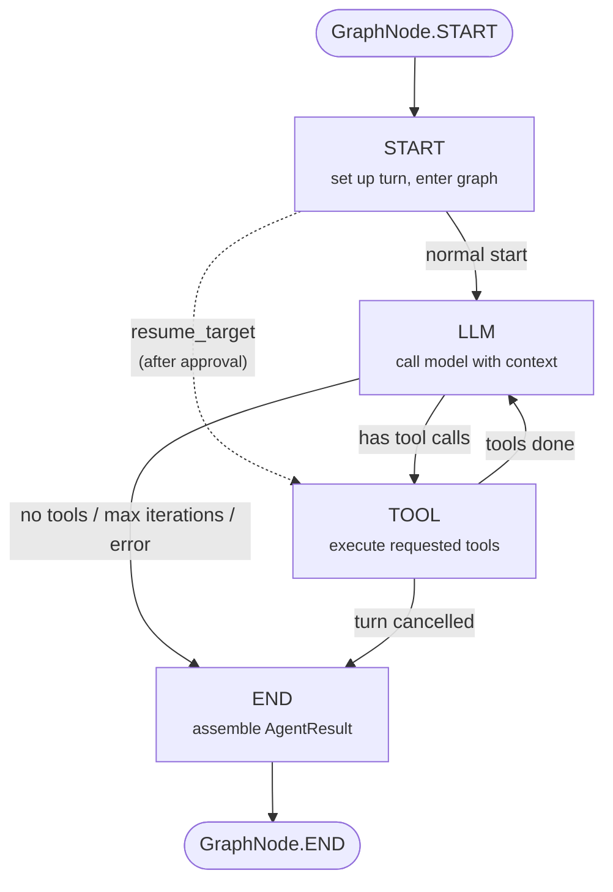
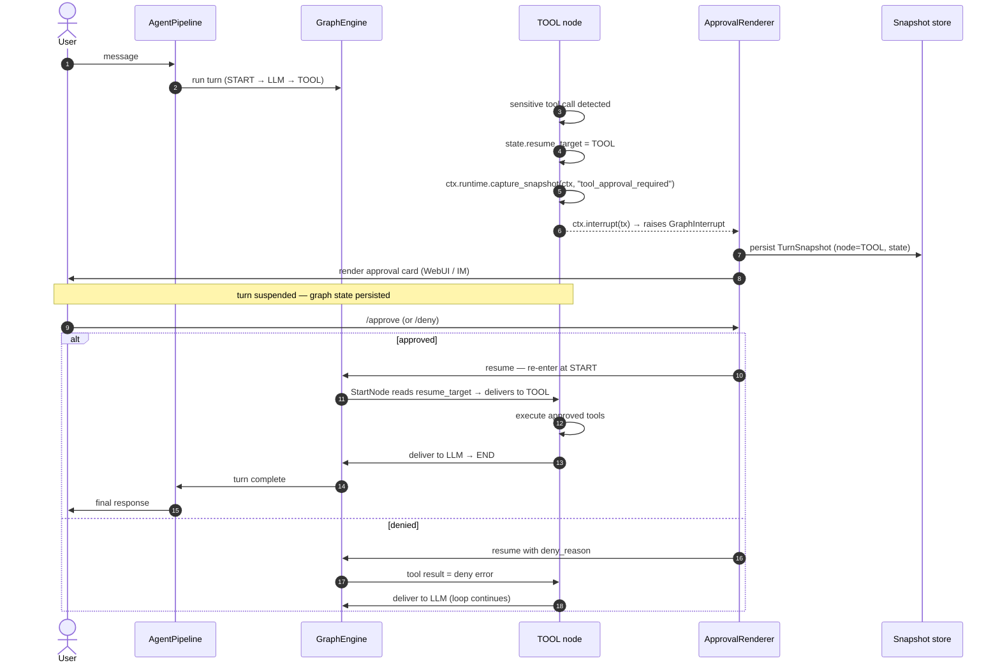

# Graph Engine

Most agent frameworks are built around a loop: call the model, run the tools it
asks for, feed the results back, repeat until done. ModexAgent's built-in
**ReAct agent** replaces that loop with a **graph-driven execution engine**.

That engine lives in `modex_graph` — a **standalone Python package** (per
[ADR-0033](https://github.com/moyu-er/ModexAgent/blob/main/docs/adr/0033-generalized-graph-engine.md))
that depends only on Pydantic and the standard library. It is a sibling of
`modex_agent`, not a submodule: `modex_agent` depends on `modex_graph`, the
reverse is **forbidden** and enforced by an architecture guard test. Any
project can adopt the graph engine without pulling in the agent framework.

The core abstraction: you declare a `Graph[S]` where `S` is a `GraphState`
(a Pydantic `BaseModel` subclass). You register `Node[S]` instances and wire
**topology edges** between them — edges declare which nodes *can* connect,
nothing more. `compile()` validates the topology and produces an immutable
`CompiledGraph[S]`; a `GraphEngine` then drives execution by delegating to a
**scheduler**. Routing is decided at runtime by the nodes themselves: a node
calls `deliver(content, next_node, ctx)` to hand work to a downstream node,
and the framework dispatches it. The graph terminates at the `GraphNode.END`
sentinel.

That one design buys five things: **suspension**, **resumption**, **typed
shared state**, **controlled exits**, and — when you opt in — **parallel
fan-out with fan-in joins**.

!!! note "Which pools run the graph?"
    The graph engine is the runtime of **react pools** — the default. Other pool
    shapes exist: **external coding agent pools** (OpenCode, per ADR-0022)
    run their own CLI harness and do not use the graph at all. When this page
    says "the agent" or "the runtime", it means a ReAct agent on a graph.

## The ReAct runtime as four nodes

The built-in ReAct agent is a small graph with four nodes, assembled by
`build_react_graph()` in `modex_agent/agents/react/graph.py`. The edges are
pure topology — two sentinel edges (`GraphNode.START → START` declares the
entry, `END → GraphNode.END` declares the terminal) plus the node-to-node
wiring. Which edge is actually taken is decided at runtime by each node's
`deliver()` call, not by edge metadata.


```mermaid
flowchart TD
    GSTART(["GraphNode.START"])
    START["START<br/><small>set up turn, enter graph</small>"]
    LLM["LLM<br/><small>call model with context</small>"]
    TOOL["TOOL<br/><small>execute requested tools</small>"]
    ENDN["END<br/><small>assemble AgentResult</small>"]
    GEND(["GraphNode.END"])

    GSTART --> START
    START -->|"normal start"| LLM
    START -.->|"resume_target<br/><small>(after approval)</small>"| TOOL
    LLM -->|"has tool calls"| TOOL
    LLM -->|"no tools / max iterations / error"| ENDN
    TOOL -->|"tools done"| LLM
    TOOL -->|"turn cancelled"| ENDN
    ENDN --> GEND
```

| Node | Role |
|------|------|
| START | Sets up the turn and enters the graph. On resume from a suspended approval, reads `state.resume_target` and delivers directly to TOOL. |
| LLM | Calls the model with the current context, handles streaming, dispatches hooks and interceptors. Delivers to TOOL when the model requests tools, to END otherwise. |
| TOOL | Executes the tool calls the model requested. Suspends for approval before risky calls. |
| END | Assembles the `AgentResult` (normal / error / cancelled). Reached when the model responds without tool calls, the iteration budget is exhausted, the model errors, or the turn is cancelled. |

The dashed `START → TOOL` path is the one that makes approval work: when a
suspended turn resumes, the engine re-enters the graph at the entry node, and
the entry node routes directly to TOOL — so the model isn't called again just
to repeat the tool call it already asked for. This is
**suspend-without-re-execution**: the interrupted node body is never re-run;
graph topology carries the resume logic.

Because the loop is a graph, the framework always knows *which node* a turn is
in and *what state* it carries. That is what makes the next features possible.

## Routing: deliver and submit

`Node.execute(ctx, integrated_input)` returns **void** — it never returns a
route. Instead, a node routes by calling `deliver()` during execution:

```python
async def execute(self, ctx, integrated_input) -> None:
    result = await do_work(ctx)
    self.deliver(result, "next_node", ctx)      # explicit target
    self.deliver(result, None, ctx)             # resolve via topology (downstream edges / END)
```

The framework wraps this in a fixed lifecycle (`Node.run`): begin an
invocation, integrate upstream deliveries into `integrated_input`, call
`execute()`, then `submit()` — which groups the accumulated delivers by target
and dispatches each group. Downstream nodes receive the payload as
`integrated_input` on their own `execute()`.

This replaces an earlier transition/`Command(goto=...)` routing model with one
uniform mechanism, and it buys several things at once:

- **Conditional routing is just an `if`** — the node picks its target in
  ordinary Python instead of declaring reason-keyed edges up front.
- **Fan-out is free** — call `deliver()` several times with different targets
  and the scheduler dispatches each group (concurrently, under the parallel
  scheduler).
- **A safety net against forgetful nodes** — if `execute()` produces no
  delivers, the framework re-runs it with error feedback injected into the
  input (up to `max_retry`, default 3), then raises `RoutingError`.

Both `deliver()` and `submit()` are node-overridable customization points; the
defaults cover the common cases.

## Two schedulers: linear and parallel

`Graph.compile(scheduler=...)` picks the execution model; the `CompiledGraph`
carries the choice and `GraphEngine` delegates to it
([ADR-0034](https://github.com/moyu-er/ModexAgent/blob/main/docs/adr/0034-parallel-scheduling-engine.md)):

- **`LinearScheduler`** (default) — the original sequential engine: one node
  at a time, the first delivered target becomes the next node. ReAct and all
  simple graphs use this and pay no tax for the parallel machinery.
- **`ParallelScheduler`** (opt-in) — a parallel scheduling engine for
  fan-out/fan-in workloads (MapReduce-style graphs, multi-arm pipelines).

The parallel scheduler uses **continuous, event-driven scheduling** rather
than BSP-style supersteps: a node instance starts the moment its dependencies
are satisfied — there is no batch barrier, so a fast branch never waits for a
slow one. Three concepts drive it:

- **Node instances.** Every execution of a node is an independent instance
  (`{node_name}#{seq}`) with a lifecycle: DORMANT → PENDING → READY → RUNNING
  → COMPLETED. Loops simply produce new instances (`body#0`, `body#1`, ...)
  instead of resetting state.
- **Trigger modes.** Each node declares when it fires. `ON_ALL_PREDS`
  (default) waits until every *activated* predecessor has dispatched to it —
  with a reachability check so a join never fires early while another branch
  could still reach it. `ON_RECEIVE` fires once per dispatch received,
  serialized through a per-node FIFO gate while an instance is in flight.
- **Shared state.** Parallel instances get their own context shells but share
  the same `ctx.state`; asyncio's single-thread model serializes the
  synchronous lifecycle segments, so there is no merge step and no
  conflict-detection machinery. The graph ends when no instance is ready or
  running; the `END` sentinel implicitly waits for all branches.

`max_iterations` remains the engine-level panic net in both schedulers — it
counts every node instance execution and raises `GraphRecursionError` when
exceeded.

## State: typed, shared, snapshot-persisted

Every graph operates on a `GraphState` — a mutable Pydantic `BaseModel`
subclass shared by all nodes. State mutation is imperative and uniform:
`ctx.state.iteration += 1` inside `execute()`. There is no delta/merge layer —
what you write is what the next node reads, under both schedulers.

```python
from modex_graph import GraphState

class MyState(GraphState):
    iteration: int = 0
    items: list[str] = []
    resume_target: str | None = None   # base field: where to re-enter after a suspend
```

Persistence is snapshot-based: `state.checkpoint()` serializes the whole
model to JSON (`model_dump(mode="json")`), and
`GraphState.from_checkpoint(data)` validates it back. Snapshots are written on
every invocation completion and on every suspend, which is what makes
crash recovery and approval resume possible.

## GraphInterrupt: suspend, approve, resume

Any node can suspend execution mid-turn by calling `ctx.interrupt(value)`,
which raises a `GraphInterrupt` — a member of the `GraphBubbleUp`
cooperative-control exception family. The engine **never swallows** these;
they propagate to the caller verbatim.

The interrupt carries a payload (e.g. an `ApprovalTransaction` awaiting a
human decision). Before raising, the suspending node sets
`state.resume_target` (and typically captures a snapshot via
`ctx.runtime.capture_snapshot(...)`), so the entry node knows where to
re-enter. Already-applied state updates and side effects **persist** across
the interrupt boundary. On resume the graph re-enters at the entry node (NOT
by re-running the interrupted node body), which reads `resume_target`, clears
it, and delivers straight to the target. This is what makes ModexAgent's
interruptible approval work — a risky tool call suspends, a human approves,
and execution continues exactly where it stopped.


```mermaid
sequenceDiagram
    autonumber
    actor U as User
    participant P as AgentPipeline
    participant G as GraphEngine
    participant T as TOOL node
    participant A as ApprovalRenderer
    participant S as Snapshot store

    U->>P: message
    P->>G: run turn (START → LLM → TOOL)
    T->>T: sensitive tool call detected
    T->>T: state.resume_target = TOOL
    T->>T: ctx.runtime.capture_snapshot(ctx, "tool_approval_required")
    T-->>A: ctx.interrupt(tx) → raises GraphInterrupt
    A->>S: persist TurnSnapshot (node=TOOL, state)
    A->>U: render approval card (WebUI / IM)
    Note over T,U: turn suspended — graph state persisted
    U->>A: /approve  (or /deny)
    alt approved
        A->>G: resume — re-enter at START
        G->>T: StartNode reads resume_target → delivers to TOOL
        T->>T: execute approved tools
        T->>G: deliver to LLM → END
        G->>P: turn complete
        P->>U: final response
    else denied
        A->>G: resume with deny_reason
        G->>T: tool result = deny error
        T->>G: deliver to LLM (loop continues)
    end
```

!!! warning "Never swallow GraphInterrupt"
    `GraphInterrupt` is control flow, not an error. It must never be caught and
    swallowed, or a paused approval would silently vanish.

## Persistence, recovery, and external control

`modex_graph` ships a three-store persistence layer — a `GraphInstanceStore`
(one row per graph run), a `NodeStateStore` (per-node invocation lifecycle
with full state snapshots), and a `DeliverStore` (per-node delivery
consumption state) — coordinated by a `GraphPersistenceCoordinator`. Each
store is an ABC with Null (default, no-op), in-memory, and SQLite
implementations; a `CoordinatorFactory` assembles them, and
`modex_agent/orchestration/` provides the SQLite factory used by the bot
runtime.

Invocation lifecycle transitions are **compare-and-swap**: completing,
suspending, or cancelling an invocation only succeeds if the row is still in
the expected state, and a lost race raises `InvocationStateError`. Recovery
needs no separate checkpoint store: `load_for_recovery()` rebuilds the main
state from the newest snapshots and re-dispatches from still-pending
deliveries.

Each graph run is a `GraphInstance` with an explicit status machine:
`running`, `paused`, `stopped`, `crashed`, `completed`, `failed`. A crashed
instance is auto-recovered by fault recovery; a paused one resumes only on an
explicit `resume()`; `stopped` is a **terminal** state — a stopped instance
cannot be resumed, and resume accepts `PAUSED` only.

External control rides the same rails. A `GraphRunControl` handle carries
pause/stop requests into scheduler safe points, where the scheduler raises
`GraphDrained` (another `GraphBubbleUp` member — never swallowed) and persists
its progress first. All control operations — REST, CLI, or the
`GraphOrchestrator` in `modex_agent/orchestration/` — converge on a single
`GraphControlService` path, so a WebUI pause button and a `modexctl` command
behave identically ([ADR-0035](https://github.com/moyu-er/ModexAgent/blob/main/docs/adr/0035-modexctl-control-plane.md)).

## Declarative graphs and the generic node library

Imperative building (`Graph()` + `add_node` + `add_edge`) is not the only way
to assemble a graph. A `GraphSpec` is a fully serializable, declarative
description — named nodes with a `node_type` and config, topology edges, a
state class, a scheduler kind — and it is the unit that gets persisted. The
chain is:

`GraphSpec → GraphSpecCompiler → CompiledGraph → GraphInstance → GraphEngine`

The compiler resolves each `node_type` through a `NodeRegistry` of
`NodeFactory` instances (each factory declares a Pydantic config schema), and
a `TopologyValidator` checks structural soundness (reachability from START and
to END, cycle rules) before anything runs. The `GraphOrchestrator` in
`modex_agent/orchestration/` wires this whole chain for the bot runtime.

Four generic node types ship with the engine, each with a matching factory:

| Node | What it does |
|------|--------------|
| `FunctionNode` | Wraps any sync or async function `fn(ctx)` as a node and delivers its result. |
| `GraphAsNode` | Wraps a `CompiledGraph` as a node in an outer graph (see below). |
| `DelayNode` | Sleeps for a configured duration, then delivers a tick — for rate limiting and pacing. |
| `HumanInputNode` | Suspends via `GraphInterrupt` with a prompt payload; delivers the human's answer on resume. |

## Graph-is-a-Node

`CompiledGraph` subclasses `Node` — a compiled graph can be embedded as a node
inside an outer graph, enabling **subgraph nesting** and reusable graph
fragments without special-casing. The inner graph runs its own engine loop on
the shared context (`state`, `runtime`, `user_data` are shared with the
parent), writes its result to a state field, and the `GraphAsNode` wrapper
delivers a completion signal downstream.

## Sync and async entry points

Node bodies are `async`. The engine offers two entry points over the same
scheduler: `run_async(ctx)` for event-loop-bound runtimes (ReAct agents), and
`run(ctx)` — a thin `asyncio.run` wrapper — for standalone scripts, CLIs, and
REPLs. Plain synchronous callables join in through `FunctionNode`, which
accepts either kind of function.

## GraphRuntime: AOP without core intrusion

`GraphRuntime` is an ABC with **default no-op implementations** — the engine
runs with zero AOP wiring. Business modules (like `ReactGraphRuntime`) subclass
it to bridge hooks, interceptors, governance, and approval into the graph.

Two methods are engine-auto-invoked at every node boundary — `before_node` /
`after_node`, the universal lifecycle points. The rest are called explicitly
by node code when business-specific AOP is needed: `dispatch_hook` (fire a
named hook point), `around` (wrap a call in the interceptor chain),
`apply_governance` (transform messages before an LLM call), `drain_control`
(check for cancellation at safe points), `capture_snapshot` (persist turn
state before a suspend), and `emit` (stream an event). Under the parallel
scheduler these may fire concurrently, so implementations must be
concurrency-safe.

!!! note "Iteration hooks are not engine-auto-invoked"
    "Iteration" is a ReAct concept (one LLM + TOOL cycle), not a universal graph
    concept. ReAct nodes dispatch `BEFORE_ITERATION` / `AFTER_ITERATION`
    explicitly via `ctx.runtime.dispatch_hook(...)` at the exact code points that
    define an iteration. The graph engine itself has no notion of iterations.

The engine stays free of `modex_agent` types: `hook_point`, `scope`, and
`event_type` parameters are `str` (business modules pass `StrEnum` values, which
are `str` subclasses). This is what keeps `modex_graph` framework-agnostic.

## Loop detection: a controlled exit

A ReAct loop can get stuck: the model keeps requesting the same tool calls
without making progress. A naive framework burns tokens until the context
window or your budget gives out.

ModexAgent's loop detection
([ADR-0016](https://github.com/moyu-er/ModexAgent/blob/main/docs/adr/0016-loop-detection-controlled-exit.md))
treats this as a **controlled exit**, not a graph transition. A
`LoopDetectionHook` runs after each LLM response, scans the recent assistant
turns for "near-identical content **and** identical tool calls" repeated in a
row (default window of 5 consecutive steps, clamped to 2–8, at a content
similarity threshold of 0.85), and raises a `LoopDetectedError`. Because the
error inherits `AgentControlError`, it propagates *around* the graph —
straight to the agent's exit handler — instead of becoming another edge. You
get a clean termination and a chance to inspect what happened, instead of a
surprise bill.

Two safety layers coexist: the **business-level** max (the LLM node checks the
iteration count and delivers to END — a *normal* result) and the
**engine-level** `max_iterations` safety net (exceeding it raises
`GraphRecursionError` — an *abnormal* exit that prevents infinite loops). The
engine-level N should be larger than the business max.

`AgentControlError` is part of the framework's control plane — the same
exception family that `/stop` and the WebUI pause button raise. See
[Runtime Layers](runtime-layers.md) for how Hook, Interceptor, and Control
compose.

## Where to next

- ReAct subagents in [Multi-Agent](multi-agent.md) pools run the same graph
  runtime, so they can suspend for approval too. External coding agent pools
  (OpenCode) do not.
- What the LLM node sees each pass is shaped by the [Memory](memory.md) tiers.
- The `LoopDetectionHook` and cancellation path tie into the three-layer
  [Runtime Layers](runtime-layers.md) model.
- The authoritative designs live in
  [ADR-0033](https://github.com/moyu-er/ModexAgent/blob/main/docs/adr/0033-generalized-graph-engine.md)
  (generalized graph engine) and
  [ADR-0034](https://github.com/moyu-er/ModexAgent/blob/main/docs/adr/0034-parallel-scheduling-engine.md)
  (parallel scheduling).
- Ready to run an agent? Head to [Get Started](../../get-started.md).
