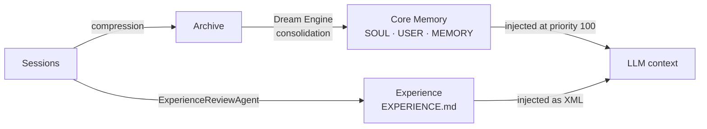

# Memory

An agent that forgets everything between turns is a chatbot with tools.
ModexAgent gives agents layered memory, so short turns add up to long-term
competence.

## The tiers

| Tier | Purpose |
|------|---------|
| Session | The active conversation's working memory. |
| Archive | Long-term storage for history that has left the session window. |
| Core Memory | Durable, distilled knowledge the agent manages in-context — `SOUL.md` (agent identity), `USER.md` (user profile), `MEMORY.md` (distilled facts). |
| UserRetentionBuffer | Retains user-scoped memory beyond a single session. |
| Pruned | A catalog of messages removed by cleanup, so the model still knows what was taken out. |
| Experience | Reusable lessons written as `EXPERIENCE.md` reference files. |

!!! note "Core Memory, not Knowledge"
    This tier was renamed from "Knowledge" to **Core Memory** per
    [ADR-0035](https://github.com/moyu-er/ModexAgent/blob/main/docs/adr/0035-core-memory-and-knowledge-base-terminology-split.md)
    to disambiguate it from the forthcoming **KnowledgeBase** (RAG) module. The
    XML tag values (`<your_identity>`, `<user_profile>`, `<known_facts>`) and the
    file names (`SOUL.md` / `USER.md` / `MEMORY.md`) are **not** renamed — they
    are agent-facing prompt artifacts and user workspace data.

### Core Memory vs. KnowledgeBase

These two concepts are easy to conflate. They are distinct:

| | Core Memory | KnowledgeBase *(forthcoming)* |
|---|---|---|
| What | Agent identity, user profile, distilled facts | Retrievable domain knowledge (RAG corpus, FAQ, reference data) |
| Where | In-context — always injected into the system prompt | Out-of-context — retrieved on demand via search / tool / injection |
| Managed by | The agent itself, through scoped file tools | Typically shared across agents or scoped to a pool / workspace |
| Aligned with | Letta's "Core Memory" (`persona` + `human` blocks) | LangChain / LlamaIndex / mem0's RAG-vs-Memory distinction |

The KnowledgeBase ABC is designed by a forthcoming ADR-0036. Its framework
contract will be minimal — only `search()` is mandatory; CRUD and maintenance
are optional mixins or business-layer concerns.

### Pruned: no silent holes

Pruned works **independently of the archive**. When cleanup prunes messages,
they are written to a `pruned/{session_id}/` catalog, and an injection policy
feeds that catalog back to the model as XML at **priority 85**. Every agent —
main or subagent — gets this injection, so pruning never creates silent holes
in context.

### Experience: written, not just stored

The `ExperienceReviewAgent`, itself a ReAct agent, reviews conversations and
creates or updates `EXPERIENCE.md` files, turning one-off interactions into
reference knowledge the agent can consult on later tasks. The experience layer
is injected as `<available_experiences>` XML.

## Scopes: who a memory belongs to

Every memory carries a scope that decides who shares it. Available scopes
include Session, User, Tenant, Agent, Channel, Chat, Composite, and Global,
with `SessionScope`, `UserScope`, and `GlobalScope` as the common cases. A fact
stored at User scope follows the user across sessions; a Session-scoped fact
dies with the conversation.

## Storage contract: split store ABCs

Memory storage is backend-pluggable through **split store ABCs** (per
[ADR-0023](https://github.com/moyu-er/ModexAgent/blob/main/docs/adr/0023-hybrid-persistence-sqlite-plus-file.md)).
Four focused interfaces replace the old monolithic storage god-interface:

| ABC | Responsibility |
|-----|---------------|
| `MessageStore` | Session messages — append, read, prune, soft-delete |
| `KVStore` | Key-value pairs (core memory blocks, cursors) |
| `CursorStore` | Read cursors for archive consumers |
| `ArchiveStore` | Long-term archive documents |

A `MemoryStoreBundle` composes all four into one frozen value returned by the
storage registry. Two backends ship:

- **File** (framework default) — one `DefaultScopedStorage` implements all four
  interfaces over per-scope directories.
- **SQLite** (bot default) — four independent `Sqlite*Store` adapters, one per
  ABC, backed by the per-workspace `state.db`.

Switching backends is a config flag (`persistence.backend`); no data migrates
automatically — users opt in.

## Compression vs. governance

Two very different processes shape what the model sees, and mixing them up
corrupts memory.

!!! warning "Governance output is never written back"
    **Compression** mutates persisted session and archive memory through
    lifecycle hooks. **Governance** mutates only the copy sent to the LLM before
    a model call; its output is never written back to the session. Governance is
    a lens on memory, not an editor of it.

One structural invariant applies everywhere: tool-call chains must stay legal.
An `assistant` message with `tool_calls` must never be separated from its
matching `tool` results, or the model API will reject the context. Compression
honors this — if a boundary would split a tool chain, the whole chain is
evicted (archived), never partially kept.

## The Dream Engine: closing the self-learning loop

Over time, archives pile up. The **Dream Engine** consolidates archived history
into Core Memory, so what the agent has done becomes what the agent knows.
Together with the `ExperienceReviewAgent`, it closes the self-learning loop:

Sessions feed archives, archives feed Core Memory, and conversations feed
Experience — all three flow back into the LLM context on every turn.

## Subagent memory

Subagents run leaner. `archive=None` is the standard session-only mode: a
subagent's session memory is temporary and cleared when the subagent finishes,
and its injection policy is restricted to a narrow context window. Long-term
remembering is the main agent's job.

## Where to next

- Memory feeds the LLM node of the [Graph Engine](graph-engine.md) on every pass.
- Subagent isolation is part of the [Multi-Agent](multi-agent.md) star topology.
- See memory in action by running the bot in [Get Started](../../get-started.md).
