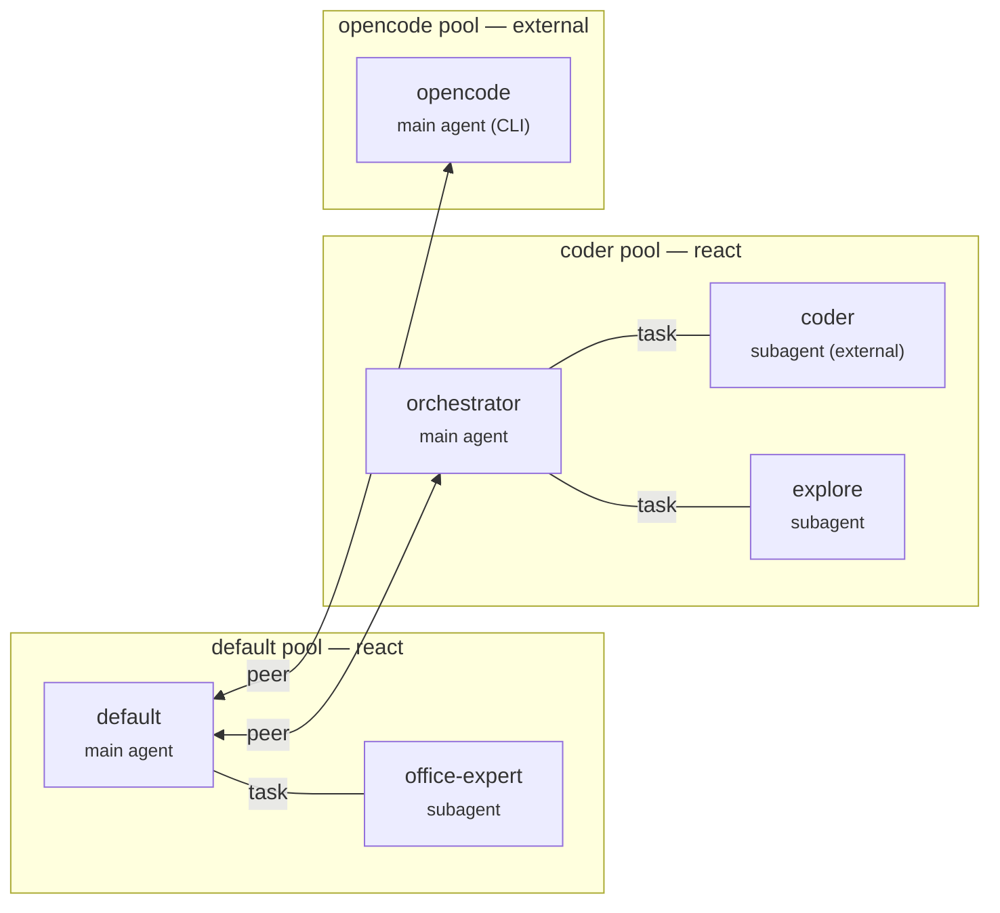

# Multi-Agent

ModexAgent runs multi-agent systems in **Pool mode**: agents live in persistent
pools, stay resident between messages, and talk to each other over routed
channels instead of ad-hoc function calls. Two components do the routing: the
`MessageBroker` moves messages, and the `AgentMessageBus` is the primary async
channel each agent listens on.

The `AgentPool` manages the resident agents' lifecycle. An **`InboxPoller`** —
one long-lived poller per pool — is the sole between-turn driver. It is
**event-driven**: every inbox writer (user input, agent-to-agent sends, the
`modexctl send` CLI, external peer replies) converges on the pool's
`AgentMessageBus.send`, which signals a pool-level wakeup `Event`, so a pending
message is picked up within milliseconds. A ~200 ms tick remains as a
defensive fallback for writers that bypass the bus. On each pass the poller
enumerates sessions with pending inbox input and starts a drain task for each
idle one. **Single-flight** is enforced structurally: an `inflight` table maps
`session_id` to the running `asyncio.Task`, set synchronously before scheduling
and popped in a `finally` block (which also re-signals the wakeup, so a message
that arrived mid-turn is scanned immediately when the turn ends). A session
that already has a live task is skipped; mid-turn arrivals are handled by
fold-in (below). Because agents are persistent, a conversation picks up where
it left off rather than cold-starting every turn.

## Star topology inside a pool

Each pool is a strict star. One **main agent** is the hub; **subagents** are
spokes.

The main agent's single outward communication tool is **`task`**. One tool
covers all three cases: dispatching a new subagent task (omit
`invocation_id`), continuing an existing subagent session (pass the
`invocation_id` returned by the earlier dispatch), and messaging a peer pool's
main agent. The framework decides internally how to deliver — broker delivery,
the async inbox, or waking an isolated subagent session. The sender never
chooses a transport.

Subagents get a different, deliberately narrower tool: **`send_to_agent`**
reaches only the parent that assigned the task, and is for *consultation* —
asking a clarifying question or requesting a decision mid-task. A subagent's
deliverable is its final reply text, which is forwarded to the parent
automatically (see the guaranteed-reply safeguard below), not anything sent
through a tool.

!!! warning "The topology gate"
    Subagents may only talk to their parent. Subagent-to-subagent and
    subagent-to-non-parent sends are rejected by the topology gate, enforced
    both at registration and again at send time. All coordination flows through
    the main agent, which keeps the communication graph readable and auditable.

Two safeguards keep the star healthy:

- **Isolation.** Each subagent gets its own Memory, ToolManager, and
  SkillManager, with a restricted, session-only memory window.
- **Guaranteed reply.** `SubagentAutoSendHook` fires at the end of every
  subagent turn and forwards the subagent's final output to its parent over the
  same bus — the sole result path, so a result arrives even though the
  subagent's `send_to_agent` is never used for reporting.

### Fold-in and materialize

Two mechanisms keep the star responsive without spawning unnecessary turns:

- **Fold-in** is the mid-turn consumption path. A turn already running drains
  its own inbox on each iteration (`InboxFlushHook.before_iteration`) and
  injects new inter-agent messages into the current turn's history as
  `role=SYSTEM_REMINDER` records — a uniform system-reminder wrapping of a
  markdown body that names the sender (`Message from agent / peer agent /
  subagent '<name>':`). It consumes only fold-eligible inter-agent types —
  **not** `external_input`, so a human DM always starts a fresh turn.
- **Materialize** builds a subagent's instance lazily, on the first turn of its
  session, rather than when a message is sent to it. `send` mints the session
  id and enqueues; the poller builds the instance from its template on that
  first turn. Main agents are eager-registered at boot by business wiring.

## Peer messaging across pools

Stars don't connect through their spokes. Instead, **main agents communicate as
peers**: a main agent can `task` another pool's main agent, which receives the
message on its own bus and replies in kind. Peer sends carry an explicit reply
contract — the message tells the receiver exactly how to answer (the `task`
tool for a native agent, the `modexctl send` CLI shim for an external one) —
because, unlike subagents, peer agents get no automatic result forwarding: a
reply only happens if the receiver chooses to send one. Pools stay autonomous,
yet a system of pools can still divide labor.

### Communication Target Store

The single routing source of truth is a pool's **`CommunicationTargetStore`**
(per [ADR-0019](https://github.com/moyu-er/ModexAgent/blob/main/docs/adr/0019-cross-pool-peer-communication.md)).
Each entry describes one reachable agent:

| Field | Role |
|-------|------|
| `name` | Agent name, unique within the store |
| `kind` | `AgentCommKind` — `NORMAL` or `SUBAGENT` |
| `pool_name` | Owning pool (local pool or a configured peer) |
| `bus_ref` | Optional direct reference to the target pool's `AgentMessageBus`; `None` means local |
| `execution_strategy` | How the target runs (`react`, `external`, …) — lets the sender's ack and the receiver's reply contract reflect an external CLI target |
| `description` | Human-readable |

When `bus_ref` is set, a `PeerNormalStrategy` delivers directly to the peer
pool's bus — no framework knowledge of "peer pool" topology, no new transport,
no broker involvement. The framework itself has no "peer pool" concept; it only
sees `CommunicationTarget` entries whose `bus_ref` points at another pool's bus.

Peer configuration is **bidirectional by invariant**: declaring B as a peer of
A requires declaring A as a peer of B, enforced at registration. The business
layer's assembly discovers configured peers, acquires bus references, and
populates each pool's store with peer main-agent entries.

### Session Group

When agent A (session `convA.mainA`) sends to peer agent C, C's receiving
session is `convA.mainC` — same prefix. C replying routes to `convA.mainA`.
Communication context therefore propagates across the **session group** — the
implicit set of sessions, across peer pools, that share a session-id prefix.
Agents see each other's contributions as if multiple people were in one room.
This is a design semantic, not a defect: peer-pool v1 deliberately adopts the
session-group model over pair-isolated sessions (which would lose bidirectional
continuity).

## The three shipped pools

The reference bot (`examples/bot_project/`) ships three pools out of the box,
each demonstrating a different shape:

```mermaid
flowchart LR
    subgraph PD["default pool — react"]
        direction LR
        MD["default<br/><small>main agent</small>"]
        OE["office-expert<br/><small>subagent</small>"]
        MD ---|task| OE
    end
    subgraph PC["coder pool — react"]
        direction LR
        MO["orchestrator<br/><small>main agent</small>"]
        CD["coder<br/><small>subagent (external)</small>"]
        EX["explore<br/><small>subagent</small>"]
        MO ---|task| CD
        MO ---|task| EX
    end
    subgraph PE["opencode pool — external"]
        direction LR
        MOC["opencode<br/><small>main agent (CLI)</small>"]
    end

    MD <-->|peer| MO
    MD <-->|peer| MOC
```

| Pool | Main agent | Shape | Subagents | Notable |
|------|-----------|-------|-----------|---------|
| `default` | `default` | react | `office-expert` (Office docs via OfficeCLI) | General-purpose assistant; approval enabled; peer hub of the shipped layout |
| `coder` | `orchestrator` | react | `coder`, `explore` | Investigation/planning coordinator; `coder` is an external coding subagent (OpenCode CLI), `explore` is read-only |
| `opencode` | `opencode` | external | — | Autonomous coding peer; no graph runtime |

Inside each react pool the topology is a strict star: one main agent as hub,
subagents as spokes, all coordinated through the single `task` tool. Across
pools, main agents talk as peers — the shipped wiring peers `default` with both
`coder` and `opencode`, including the `opencode` main agent, which has no
subagents and no graph runtime of its own.

!!! note "The coder pool mixes native and external subagents"
    Its `coder` subagent uses `execution_strategy: external` (OpenCode CLI) —
    the orchestrator delegates implementation tasks to an external CLI agent
    that runs its own tools and session, while `explore` stays a native,
    read-only ReAct subagent. See [External Coding
    Agents](external-coding-agents.md) for how this works and how it talks
    back.

## External coding agents as peers

External coding agents such as **OpenCode** join the same peer
topology as NORMAL main agents of their own dedicated pools. They don't have
the `task` tool, so they reply through a CLI shim the framework ships
for this purpose: `modexctl send`. Every other agent reaches them with the
standard `task` tool, so from the framework's point of view they are
ordinary pool mains — same peer wire, different interior. See
[External Coding Agents](external-coding-agents.md) for the contrast with
native ReAct pools, how to register one, and what the integration does and
doesn't cover.

## I/O stays outside the agent

I/O adapters are fully decoupled from agent logic. The WebUI, CLI, and IM
platforms (QQ, Telegram) all plug into the same broker, so swapping or adding a
channel never touches the agents themselves.

## Where to next

- ReAct subagents in a pool run the [Graph Engine](graph-engine.md) runtime, so
  they can suspend for approval too. External coding agent main agents
  (OpenCode) run their own CLI harness and do not use the graph.
- What each agent remembers is governed by the [Memory](memory.md) tiers.
- Set up your first bot in [Installation](../../installation.md) or
  [Get Started](../../get-started.md).
