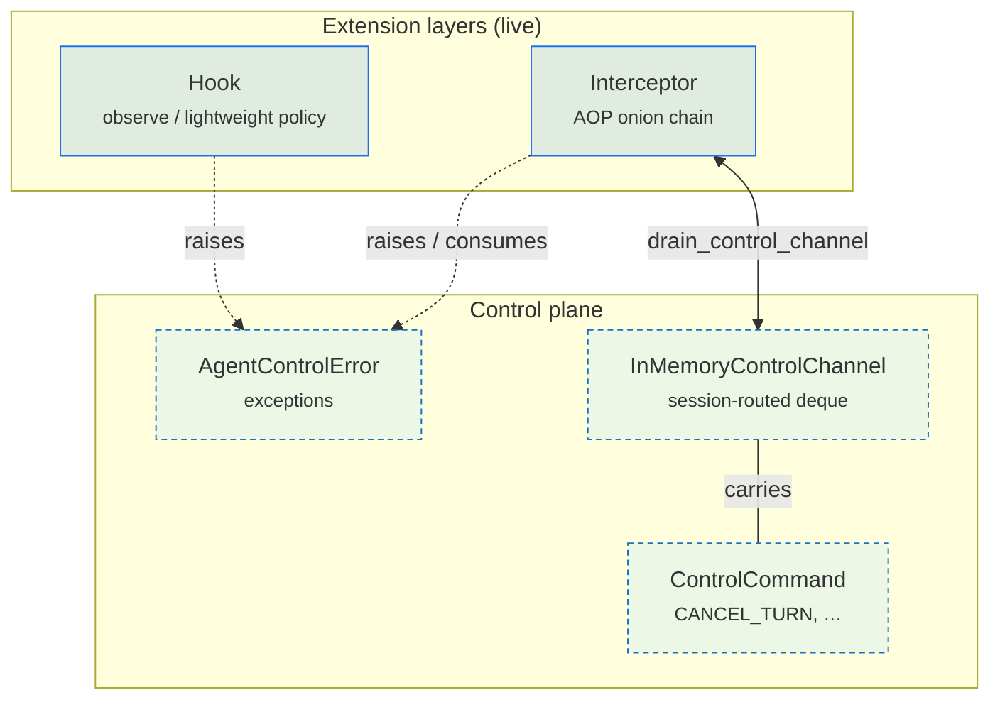
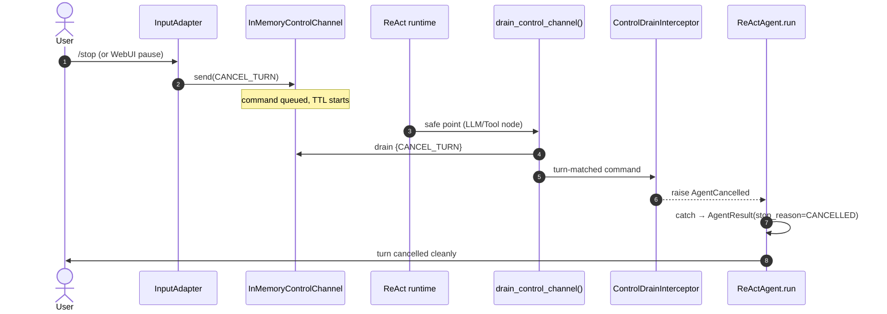

# Runtime Layers

ModexAgent's runtime exposes three concerns that look like a stack but are not a
stack: **Hook** observes the lifecycle, **Interceptor** wraps call boundaries,
and **Control** carries cancellation. They compose orthogonally — a hook can
fire while an interceptor wraps a tool call while a control command waits in a
channel — but they have different jobs, different invariants, and different
safety rules.

> Three packages, not three peers
>
> "Hook / Interceptor / Control" names three packages, but at runtime **Hook and
> Interceptor are the live extension layers**. The `control/` package carries
> the **live** `/stop` + WebUI-pause mechanism: `InMemoryControlChannel`
> receives `CANCEL_TURN`, `drain_control_channel()` feeds
> `ControlDrainInterceptor` / `LlmCancelInterceptor`, which raise
> `AgentCancelled` → `AgentResult(stop_reason=CANCELLED)`. A separate
> busy-input INTERRUPT path cancels via `asyncio.Task.cancel()` directly and
> does not go through the channel at all.

The dashed lines are the seams that matter: hooks and interceptors both **raise
`AgentControlError`** (so any layer can terminate a turn uniformly), and the
control channel is **consumed by an interceptor** (`ControlDrainInterceptor`),
not by a control-loop of its own. That is why `control/` ships the data types
and the channel, while the actual draining lives in the interceptor chain.

## Hook: observe and lightly veto

Hooks are lifecycle extension points. They execute at nine defined
`HookPoint`s, run synchronously with a default 10-second timeout, and observe
or lightly modify context — they do **not** wrap execution. A hook that needs
to transform input/output, enforce a hard timeout, or cancel a call belongs in
an interceptor instead.

| `HookPoint` | Method | When it fires | Typical use |
|---|---|---|---|
| `BEFORE_TURN` | `before_turn` | `Agent.run()` entry, once | Reset state, flush inbox |
| `AFTER_TURN` | `after_turn` | `Agent.run()` exit (all paths), once | Logging, cleanup |
| `BEFORE_ITERATION` | `before_iteration` | Each ReAct loop iteration | Dynamic tool filtering |
| `AFTER_ITERATION` | `after_iteration` | After each iteration | Restore state |
| `BEFORE_TOOL_EXECUTION` | `before_tool_execution` | Before a tool batch | Policy guard |
| `AFTER_TOOL_EXECUTION` | `after_tool_execution` | After a tool batch | Result transform |
| `AFTER_LLM_RESPONSE` | `after_llm_response` | After the LLM responds | Output guard, loop detection |
| `FINALIZE_CONTENT` | `finalize_content` | Before final output (sync) | Content formatting |
| `FINALLY_TURN` | `finally_turn` | After `AFTER_TURN`, always runs (even on error) | Last-resort cleanup |

`Hook` is an **ABC**, not a Protocol. Each `HookPoint` has a matching per-point
ABC (`BeforeTurnHook`, `AfterTurnHook`, `BeforeIterationHook`, …,
`FinallyTurnHook`) with a single `@abstractmethod`. A concrete hook inherits
from one or more of these ABCs and implements only the methods it cares about —
`HookRunner` dispatches via `isinstance(hook, dispatch_cls)`, so unimplemented
points are simply skipped. `HookRunner` applies the per-hook timeout and honors
an `HookErrorPolicy` (`IGNORE` / `LOG` / `ABORT`) on failure.
`HookResult(veto=True, message="...")` rejects an action without raising; it
is a *lightweight* denial that does **not** exit the agent, which is the line
that separates a hook veto from a control-plane cancellation.

!!! note "Per-turn state belongs in `ctx.runtime.state`"
    Pool mode means an agent instance may serve many sessions concurrently.
    Per-turn state must live in `ctx.runtime.state` (typed
    `ReActTurnState`), not in instance attributes. The framework's own
    `LoopDetectionHook` and `InboxFlushHook` follow this rule.

!!! note "Iteration hooks vs. GraphRuntime"
    `BEFORE_ITERATION` and `AFTER_ITERATION` are ReAct concepts, not universal
    graph concepts. The [Graph Engine](graph-engine.md)'s `GraphRuntime` ABC
    deliberately has no `before_iteration` / `after_iteration` methods — it
    auto-invokes only `before_node` / `after_node` at node boundaries. ReAct
    nodes dispatch `BEFORE_ITERATION` / `AFTER_ITERATION` explicitly via
    `ctx.runtime.dispatch_hook(...)` at the exact code points that define an
    iteration. This keeps the graph engine free of ReAct-specific lifecycle
    assumptions.

Built-in hooks include `logging`, `runtime_context`, `inbox_flush`,
`subagent_auto_send`, `experience_review`, `checkpoint`, `loop_detection`, and
`training_data`. The `subagent_auto_send` hook is the safety net that keeps the
multi-agent star topology healthy — if a subagent's LLM forgets to call
`send_to_agent`, it auto-forwards the final output to the parent (see
[Multi-Agent](multi-agent.md)). The `loop_detection` hook raises a
`LoopDetectedError` at `AFTER_LLM_RESPONSE` when it detects a runaway ReAct
loop (see [Graph Engine](graph-engine.md)).

## Interceptor: the AOP onion chain

Interceptors form recursive closures around call boundaries — tool calls,
turns, iterations, and LLM streams. Each can time out, transform, or cancel
the wrapped call. The chain is built once per scope and reused; index 0 is
the outermost interceptor (enters first, exits last).

| Active scope | Method | Wraps |
|---|---|---|
| `TOOL_CALL` | `around_tool_call` | An individual tool execution |
| `TURN` | `around_turn` | An entire turn |
| `ITERATION` | `around_iteration` | A single ReAct iteration |
| `LLM_STREAM` | `around_llm_stream` | The LLM streaming response |

Four more scopes are defined but not yet wired: `AGENT_RUN`, `LLM_CALL`,
`PIPELINE_STEP`, `POOL_TASK`. Treat them as reserved — the chain will reject
registration against an unwired scope.

Three invariants keep the chain safe:

1. **`around_tool_call` must return a legal `ToolResult`.** Generic exceptions
   raised inside the tool scope are caught and converted to
   `ToolResult(error=...)` so a misbehaving interceptor cannot corrupt the
   ReAct loop's expectations.
2. **`AgentControlError` and `CancelledError` always propagate.** They are
   control flow, not tool errors — swallowing them would deadlock a turn.
3. **Approval does not go through interceptors.** Approval is handled one
   layer up, in the pipeline, through `TurnSnapshot` + `ApprovalTransaction`
   (ADR-0008, ADR-0011). Routing approval through interceptors would let a
   rogue interceptor silently approve a sensitive tool call; the framework
   keeps the two paths separate.

Built-in interceptors: `ToolResultLimit` caps tool output size, and
`ControlDrainInterceptor` + `LlmCancelInterceptor` consume the control
channel — they are the seam between Control and Interceptor.

## Control: the control plane

The `control/` package provides three live things, none of which is a loop:

- **`AgentControlError` exception hierarchy** — `AgentCancelled`,
  `AgentTimeout`, `PolicyViolation`. Safe to import and raise from anywhere
  across hook, interceptor, and agent layers.
- **`InMemoryControlChannel` + `drain_control_channel()`** — a
  session-routed deque with TTL. The live mid-turn cancellation path for IM
  `/stop` and the WebUI pause button.
- **`ControlCommand` / `ControlCommandType` / `ControlScope`** — the
  command payload types carried by the channel.

`ControlCommandType` defines five members. They are not equal — most are live,
one is vestigial:

| Command | Live? | Producer → consumer |
|---|---|---|
| `CANCEL_TURN` | ✅ | IM `/stop` or WebUI pause → channel → `drain_control_channel()` → interceptor → `AgentCancelled` |
| `CANCEL_RUN` | reserved | Defined for completeness; not on a live path |
| `INJECT_USER_MESSAGE` | reserved | Defined for completeness; not on a live path |
| `INJECT_STEER` | partial | Written in STEER busy-input mode; the default drain filters `{CANCEL_TURN}` only, so verify before relying on it |
| `APPROVAL_RESPONSE` | ❌ vestigial | Retained for protocol compatibility, no live producer or consumer |

!!! warning "Approval does not flow through the control channel"
    `APPROVAL_RESPONSE` is a leftover from a removed half-built path
    (ADR-0008). Real approval decisions take two independent routes,
    **neither** of which touches this channel:

    - **WebUI**: a structured `InputMessage.approval_decision` rides the
      input pipeline → `AgentPipeline._process_message` →
      `ApprovalResumer.apply_resume`.
    - **IM**: `/approve` / `/deny` resolve via `CommandAction.APPROVAL_DECISION`
      result fields in the command processor → the same `apply_resume`.

    If you are wiring approval, use one of those paths — never the channel.

## How cancellation works

There are **two independent** cancellation mechanisms. Knowing which one is
in play is the difference between a clean stop and a stuck turn.

### (A) Channel-based — IM `/stop` + WebUI pause

`InMemoryControlChannel` is constructed by `BotService` and wired into the
input adapter through `configure_control_filter()`. Two UI paths send
`CANCEL_TURN` into it:

- **IM `/stop`**: `input_pipeline/stages/session_control.py` →
  `InputAdapter._try_intercept_control("/stop")` → `channel.send(CANCEL_TURN)`.
- **WebUI pause**: `bot/webui/server.py` `_ws_pause` → the same
  `_try_intercept_control` path.

`drain_control_channel()` (`hook/builtin/control_drain.py`) drains
`{CANCEL_TURN}` at safe points and raises `AgentCancelled` on a turn-matched
command. The drain is invoked from the ReAct `LLMNode` (before and after the
LLM call), `ToolNode._execute_batch`, the agent iteration loop, and inside
two interceptor wrappers registered in `bot/workspace/wiring.py`:
`ControlDrainInterceptor` (TOOL_CALL) and `LlmCancelInterceptor`
(LLM_STREAM). `AgentCancelled` is caught in `ReActAgent.run` and surfaces as
`AgentResult(stop_reason=CANCELLED)`.

### (B) Task-based — busy-input INTERRUPT

When a new message arrives in `BusyInputMode.INTERRUPT`,
`AgentPipeline._process_message_locked()` calls `existing_task.cancel()` on
the running asyncio task. This raises pure `asyncio.CancelledError` — no
channel, no `AgentControlError`, no drain. It is faster and simpler, but it
cannot be observed by hooks or interceptors; if your logic needs to react to
cancellation, route through path (A) instead.

The sequence diagram shows path (A). Path (B) skips every participant except
`U`, `A`, and `R` — `existing_task.cancel()` lands directly as
`CancelledError` inside the running task.

## Where to next

- A `GraphInterrupt` suspends a turn so it can resume; an `AgentCancelled`
  terminates it. The two are distinct — see [Graph Engine](graph-engine.md)
  for the suspension path and how it differs from the cancellation path here.
- The `subagent_auto_send` hook is one of the safeguards that keeps the
  multi-agent star healthy — see [Multi-Agent](multi-agent.md).
- Loop detection (ADR-0016) runs as a hook at `AFTER_LLM_RESPONSE` and raises
  a control-plane exception; see [Graph Engine](graph-engine.md) for the
  full picture.
- Ready to wire your own hook or interceptor? Head to
  [Get Started](../../get-started.md).
